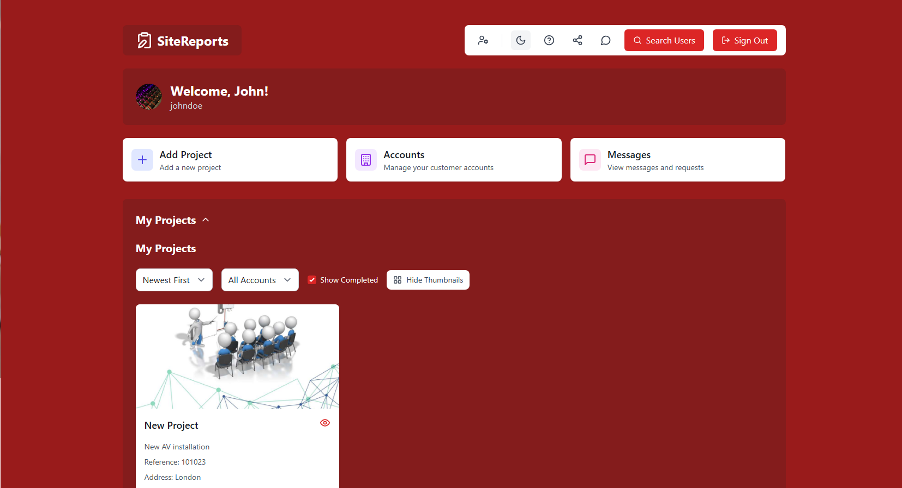

# Dashboard

The SiteReports dashboard is your command center for managing all your AV installation projects.

## Dashboard Overview

When you log in to SiteReports, you'll be greeted by your personalized dashboard. This central hub provides:

- A quick overview of all your projects
- Recent activity and notifications
- Quick access to create new projects
- User profile management

## Key Components

### Projects Summary

The Projects Summary section displays:

- Total number of active projects
- Projects organized by status (in progress, completed, upcoming)
- Quick filters to sort and find specific projects

### Recent Activity

This section shows your most recent activities:

- Recently updated projects
- Latest tasks assigned to you
- Recent asset status changes
- New team messages

### Quick-Link Buttons

The dashboard provides one-click access to key functions:

- **Add New Project**: Start creating a new project
- **Manage Accounts**: Access account settings and team management
- **Access Messages**: View and respond to messages from team members

### User Profile

The user profile section allows you to:

- Edit your profile information
- Update your profile picture
- Manage notification preferences
- Change password and security settings

## Project Cards

Each project is represented by a card showing:

- Project name and client
- Project status and progress
- Address and location
- Quick access to project details

Click on any project card to navigate to its detailed project page.

## Search Functionality

The dashboard includes a powerful search function that allows you to:

- Find projects by name, client, or location
- Search for specific team members
- Locate assets by name or serial number
- Find tasks by description or status

## Customizing Your Dashboard

You can personalize your dashboard by:

1. Clicking the "Customize" button in the top right corner
2. Choosing which widgets to display
3. Arranging the layout to suit your workflow
4. Setting default filters for projects and tasks

## Dashboard Settings

Access additional dashboard settings by clicking the gear icon:

- Change the time period for displayed activities
- Set default project sorting
- Configure notification preferences
- Adjust display options

## Next Steps

Now that you understand the dashboard, learn more about:

- [Creating new projects](../guides/create-project)
- [Managing project details](reports)
- [Setting up team access](../guides/team-access)